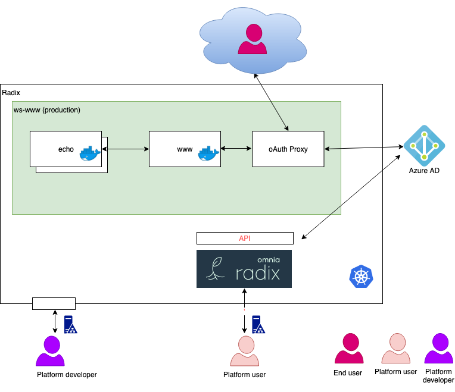

# Radix oAuth2 proxy example
(Based on[radix-example-workshop-1](https://github.com/equinor/radix-example-workshop-1))

Purpose - a simple two module app with a oauth2 proxy in front

## Content

- ```echo``` contains the echo module
- ```www``` contains the www front-end
- [oauth-proxy](./oauth-proxy)contains the proxy

## A conceptual overview of the application.

 
